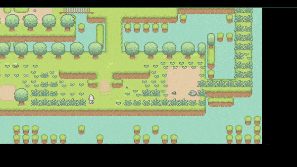

# November

I have loved Pokemon since a I was a 13 year old child. Charizard was my favorite Pokemon at the time.
Limited access to TV and friends, my escape was this fantasy world where I could befriend these creatures.
A world where dragons were as real as ghosts. The anime series could only feed me so much and in time I started looking.
Discovered the official pokemon.com website, the pokedex, events and what not but none of it available to my country.
At that age, I was used to it but I kept looking and I heard about a GBC game called pokemon crystal.

I tried hard to find it, and all I got was a copy in Spanish. Nevertheless the 8-bit intro music still brings peace to me.
I barely understood the dialog of the game but that didn't stop me from playing. The joy of getting my own pokemon (I picked Typhlosion),
and running into the grass to battle a hoot hoot was the best thing ever for my 13 year old self. I departed from the series after Pokemon Black and White.
Life got busy and childhood needed to rest. 

Years later, I still remember that game for its simplicity. Children my age had access to games that won't run on my computer, yet I wasn't settling.
The pixelated graphics, simple art style, no _seemingly_ real interactions but all that meant nothing in front of hours of exploring cities, defeating
team rocket, training pokemon and grinding till they would evolve to their final forms. It had no substitute. I tried to play the old games
and realized I didn't like a few things after all. I didn't like the battle scene, I didn't like the lack of interaction with the environment.

1. You could cycle but that's like walking 2-4x faster.
2. You could using fishing rods but it was all about timing the "A" button.
3. You could use surf and dive in water. Honestly diving was a refresher. Underwater caves and explorations in Pokemon Emerald were breathtaking.
4. You could use various pokeballs to catch pokemon but arbitrary probability would lead to capture.
5. The most exciting battle scene felt like pictures. No movement, No reaction to damage, while there was an attack animation it just felt like
    a special effect translated from a point to another.
6. Rare pokemon were limited to events.
7. Trading required custom hardware. Although things have changed now. Its a smaller world with a wifi connection.

At my age, I think it is a good way to pay respect to the devs that gave me a hopeful childhood,
by trying to extend the idea and see for myself if my expectations make sense for a role playing game.

## Game Design

WIP. 

- The Main Character (MC) can explore an open world map. I am starting with a static image but want to learn building dynamic maps.
- There are hostile monsters that can attack the MC.
- There are curious/friendly monsters that can join the MC in their journey.
- Battling monsters generates gold (in-game currency).
- The map can generate items that can be collected.
- Living things have a healing factor (which can be reduced).

## v1

### 30 Jun, 2022 - 2 July, 2022

This was a humbling experience. I thought I could have pulled it off in one day but it took me over 2 days and 5 hours.
I learned building tiled maps. There was a lot of struggle figuring out resolutions and I'll be honest, I have skimmed that part.
Regarding the background image, there were a couple of things to worry about. 

The world is made of a grid with 30 x 40 tiles. This was decision was taken on tiled map editor.
At that moment, I wasn't aware of the choices I am making but I thought I would figure out the maths later.
Later on HTML5 land, I built the canvas and set the resolution of 1280 x 720. Things didn't look good:

- Canvas tries to anti-alias images. Since I am already using pixel art I had to turn it off.
- The image was not scaled to the resolution.

However, I moved on and added the sprite for my main character and started integrating the tile-map for collisions.
It was this moment, when I started panicking. The collision tiles would not align. No, it wasn't because of offsets
the image seemed to belong to a completely different resolution than the collision tiles. To work out the correct resolution,
I used the 30x40 rule for the world. Decided to use a 64px for single collider block (a square). Giving me the resolution
of 1920 x 1440.

Detecting collisions was still hard. The way the illusion of movement works is: everything except the player moves!
I had a hard time understanding this but it made sense. This way you don't need to code up a virtual camera to follow 
the player, saving a lot of code. I was stuck for a while having the MC touch a collider and never getting to move out of it.
So I tried a pre-emptive approach to prevent movement if the MC's movement speed would lead to a collision in the next frame.

Collision is still not perfect. There are places (like a bridge) where the MC can't walk over since there is an invisible collider
block due to the ocean water right above. This isn't very intuitive and I may have to customize certain colliders to be more forgiving
when an entry is in a certain direction. Since the impact is cosmetic I will not work on it for now.

The sprite animation took a while to smoothen. I had to study how requestAnimationFrame works. It calls your function approx 16ms.
It may not do that if you switch a tab or are running an `<Iframe>`. This gave me a hint to move the sprite face in the order of 10e-3.
I think a reset to idle frame is a good touch and possibly simple.

I also don't like the way foreground works. The foreground is a single image so items that are farther also cover the MC, giving the
game a very flat appearance. I think I need to have the foreground imported separately and row-wise. This way I can tell which
rows should come before the MC but it seems very inefficient.

Here's a demo.

Credits to my resources:

- [Sproutlands](https://cupnooble.itch.io/sprout-lands-asset-pack) from [itch.io](https://itch.io/). I have supported the creator by purchasing the premium edition.
- This project draws inspiration from [Chris Courses YT video](https://www.youtube.com/watch?v=yP5DKzriqXA&t). I have made a lot of different
    design choices but want to credit the creator for the time they spent on the video. It helped me stay motivated and gave me a solid starting point.

## Todos

- [x] Render the map.
- [x] Render the collision grid.
- [x] Implement collision detection.
- [x] Move the MC around the MAP.
- [x] Animate MC's movements.
- [ ] Create attacks.
- [ ] Create/Destroy interaction with tiles.
- [ ] Animate MC's attacks.
- [ ] Add a monster sprite.
- [ ] ...
- [ ] Build maps dynamically.
- [ ] Build and Destroy ability for MC.

